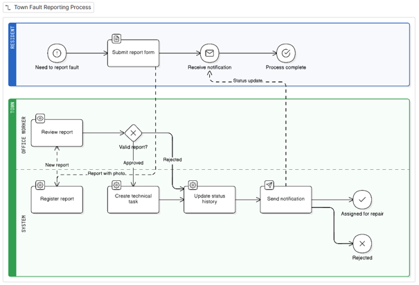
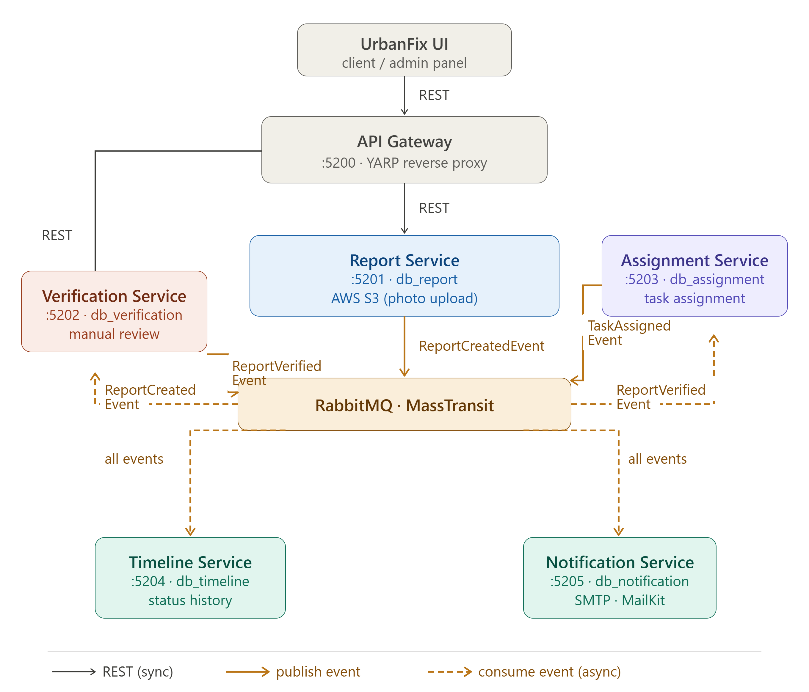

# UrbanFix 🛠️

## 🏗️ Architecture & Business Process

This section provides a detailed breakdown of the **UrbanFix** core business workflow and its underlying event-driven microservices architecture.

---

### 🔄 Business Process Flow

The fault reporting process spans three distinct lanes: the **Resident** (frontend/client), the **Office Worker** (admin/reviewer), and the background **System** automation. 



#### Detailed Workflow Steps:
1. **Fault Submission:** A **Resident** identifies an infrastructure issue and submits the report form, optionally uploading a supporting photograph.
2. **System Registration:** The **System** intercepts the submission, automatically registers the report, and instantiates its initial tracking state.
3. **Manual Review:** An **Office Worker** accesses the administration panel to manually review the submitted report for validity.
4. **Gateway Decision:**
   * **Approved:** If valid, the system automatically triggers the creation of a **Technical Task** to dispatch repair teams.
   * **Rejected:** If invalid, the process skips task creation and moves straight to denial handling.
5. **Timeline Update:** Regardless of approval or rejection, the system updates the centralized status history to maintain full auditing transparency.
6. **Asynchronous Notification:** The system dispatches an automated notification (e.g., via email) back to the **Resident** detailing the status update.
7. **End States:** The process safely terminates in one of two final states: `Assigned for repair` or `Rejected`.

---

### ⚙️ Microservices Architecture Map

UrbanFix is designed as a highly scalable, loosely coupled **Event-Driven Architecture (EDA)**. It leverages synchronous REST APIs for client-to-gateway entry, and asynchronous message brokering for inter-service communication.



#### Core Components & Services

* **UrbanFix UI:** The entry point for users, containing both the public client reporting interface and the protected administrative dashboard.
* **API Gateway (`Port: 5200`):** Powered by **YARP (Yet Another Reverse Proxy)**. It serves as the single reverse-proxy entry point, safely routing synchronous REST traffic from the UI to downstream internal microservices.

#### Backend Microservices:
* **Report Service (`Port: 5201`):** Manages the lifecycle of fault reports and handles data persistence within `db_report`. Integrates natively with **AWS S3** for secure multipart photo uploads. Once a report is successfully saved, it publishes a `ReportCreatedEvent`.
* **Verification Service (`Port: 5202`):** Provides the business logic and endpoints needed for municipal office workers to manually review and process open incidents (`db_verification`). Emits a `ReportVerifiedEvent` upon successful verification.
* **Assignment Service (`Port: 5203`):** Orchestrates the assignment of technical repair tasks (`db_assignment`). It reacts to verification updates and handles task tracking, publishing a `TaskAssignedEvent` upon scheduling.
* **Timeline Service (`Port: 5204`):** The system's centralized audit log (`db_timeline`). It subscribes to **all events** passing through the service bus to dynamically construct an immutable, chronological status history for every issue.
* **Notification Service (`Port: 5205`):** An asynchronous worker service running on `db_notification`. It consumes events from the service bus and dispatches real-time transactional updates to residents using **SMTP** and **MailKit**.

#### Inter-Service Communication & Messaging
* **Synchronous (REST):** Used strictly for client-facing operations going through the YARP API Gateway down to the primary domain services.
* **Asynchronous (Pub/Sub):** Powered by **RabbitMQ** combined with **MassTransit** as the enterprise service bus wrapper. Services communicate seamlessly by publishing and consuming strongly-typed events, completely decoupling data persistence layers from heavy downstream notification or timeline tracking workflows.

---

## 📁 Repository Structure

The repository is organized into three main top-level directories separating the local development environment, the .NET backend microservices, and the React frontend.

```text
.
├── Local/                     # Local development environment setup
│   ├── init_db/               # Database initialization scripts
│   └── docker-compose.yml     # Compose file for local DB testing (avoids AWS dependencies)
│
├── UrbanFix/                  # .NET Backend microservices solution
│   │
│   └── UrbanFix.ReportService/ # Example structure of a single microservice
│       ├── Controllers/       # REST API endpoints — HTTP request handling and routing to MediatR
│       ├── Functions/         # CQRS handlers — business logic split into Commands (writes) and Queries (reads)
│       ├── Consumers/         # MassTransit event consumers — reacting to RabbitMQ events from other services
│       ├── Models/            # Domain entity and request DTOs — database schema and HTTP input mapping
│       ├── Repository/        # Data access layer — EF Core queries and DbContext configuration
│       ├── Services/          # External integrations — AWS S3 file upload and download abstraction
│       └── Migrations/        # EF Core database migration history — incremental PostgreSQL schema changes
│
└── UrbanFixUI/                # React Vite Frontend application
    ├── public/                # Static assets served directly (favicon, etc.)
    ├── src/
    │   ├── api/               # Axios-based API client modules — one file per microservice
    │   │                      # (reportsApi.ts, assignmentsApi.ts, notificationsApi.ts, …)
    │   ├── assets/            # Images and static media imported by components
    │   ├── components/        # Reusable UI components shared across multiple pages
    │   │                      # (maps, drawers, badges, toast notifications, route guards)
    │   ├── lib/               # Utility and helper functions
    │   │                      # (error handling, response normalizers, date formatting, label maps)
    │   ├── mocks/             # Mock API handlers and seed data used during development
    │   ├── pages/             # Top-level route components — one file per application view
    │   │                      # (SubmitReportPage, TrackReportPage, AdminReportsPage, …)
    │   └── types/             # Shared TypeScript type and interface definitions
    │                          # (Report, Location, and other domain models)
    ├── index.html             # Vite HTML entry point
    ├── vite.config.ts         # Vite bundler configuration
    ├── tsconfig.json          # TypeScript compiler configuration
    ├── Dockerfile             # Docker image definition for containerised deployment
    ├── nginx.conf             # Nginx configuration for serving the production build
    └── docker-compose.yml     # Compose file for local UI container setup
